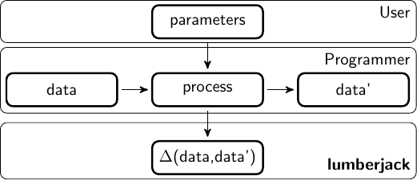

## Track changes in data
[](https://travis-ci.org/markvanderloo/lumberjack)
[](https://coveralls.io/github/markvanderloo/lumberjack?branch=master)
[](http://cran.r-project.org/package=lumberjack/)
[](https://CRAN.R-project.org/package=lumberjack)
[](http://www.r-pkg.org/pkg/lumberjack)[](http://www.awesomeofficialstatistics.org)


The `lumberjack` R package allows you to:

- **track changes** in **multiple data sets** as they get processed;
- using **multiple loggers** for each dataset;
- where loggers are **fully customizable**.

[overview of functionality](./pkg)


### lumberjack philosophy

Production scripts may contain many data transformations, aimd to clean,
select, model, or augment data with new variables. Analyzing the effect of each
step is cumbersome because it involves adding a lot of code that is not
concerned with the primary goal of the script, namely to analyze and process
data.

In the lumberjack philosophy, a programmer (analyst) should be only concerned
with the primary process of data analyses.




### Installation

Published version from CRAN
```r
install.packages('lumberjack')
```

Development version.
```r
git clone https://github.com/markvanderloo/lumberjack
cd lumbjerjack
make install
```


